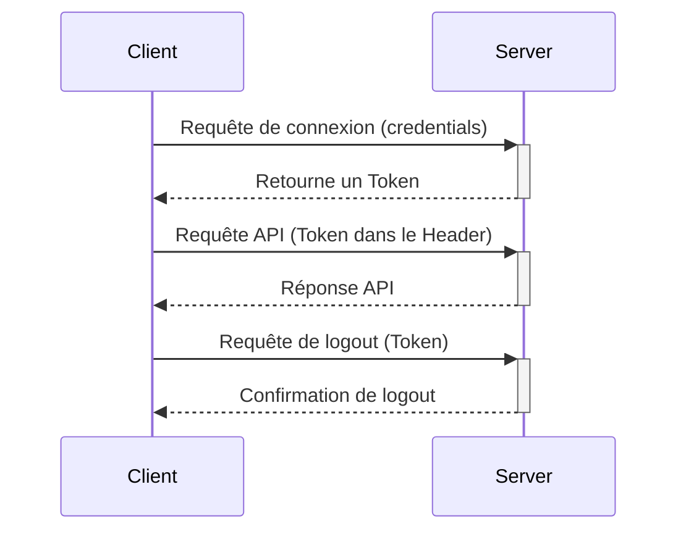
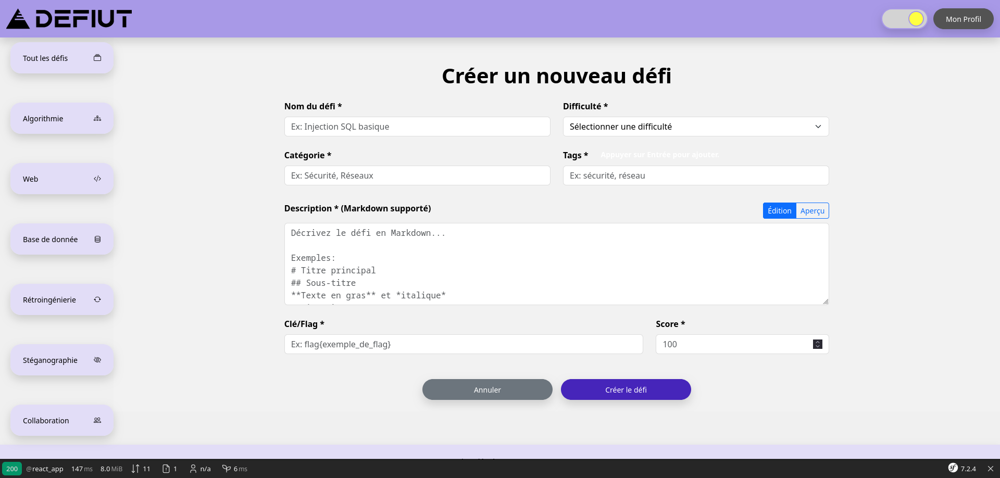

# Fonctionnement et maintenance

## Résumé rapide

L'application est divisée en deux parties :

- Une partie serveur (back-end), codée en PHP et optimisée via Symfony

- Une partie client (front-end) codée en React

Ces deux partis communiquent via des APIs : La partie client va demander à la partie serveur.

Nous stockons toutes les données dans une base de données MySQL.

L'application est basée sur une architecture par token pour échanger les données entre la partie front-end et la partie back-end, c'est à dire que chaque appel d'API nécessitant une authentification passera via un token

Voici un schéma résumant l'interaction par Token entre le client et le serveur



## Démarage et utilitaires

Nous utilisons `Cmake` pour simplifier les différentes actions
Voici les différentes commandes disponibles :

- `start` : démarage simple, en arrière-plan, sans affichage de la journalisation
- `stop` : arrête l'application
- `start_dev` : Démarre l'application en mode développement avec une reconstruction complète des conteneurs Docker.
- `stop_dev` : Arrête et supprime les conteneurs, réseaux et volumes définis dans le fichier docker-compose.
- `restart_dev` : Redémarre l'application en mode développement avec une reconstruction complète des conteneurs Docker.
- `soft_start_dev` : Démarre l'application en mode développement sans reconstruction des conteneurs Docker.
- `compile` : Exécute la commande `npm run watch` dans le conteneur Docker pour compiler les assets.
- `clear` : Supprime les dossiers `vendor`, `node_modules`, `var` et `public/build`.
- `clean_start_dev` : Nettoie les dossiers spécifiés et démarre l'application en mode développement.
- `bash` : Ouvre un shell Bash dans le conteneur Docker `defiut-php-1`.

Pour lancer une commande, il vous suffit de faire :

```bash
make <votre commande>
```

Vous pouvez en ajouter en agrandissant le fichier Makefile

## Base de données

Nous utilisons MySQL

Via le docker, nous fournissons une instance de PHPMyAdmin ([http://localhost:8080](http://localhost:8080))

Il peut être utile d'utiliser ce logiciel afin de pouvoir visualiser le bon fonctionnement du stockage des données.

> Utilisez au minimum MySQL pour interagir, afin de limiter les risques d'erreurs

Pensez aussi à changer le mot de passe MySQL inclus dans le fichier `/.env`

### Détail de l'architecture MySQL

### Table Defi

- **id**: Identifiant unique du défi. Clé primaire.
- **nom**: Nom du défi.
- **description**: Description détaillée du défi.
- **cle**: Clé unique pour identifier le défi.
- **points_recompense**: Nombre de points attribués à l'utilisateur qui complète ce défi.
- **categorie**: Catégorie à laquelle appartient le défi.
- **difficulte**: Niveau de difficulté du défi, probablement sur une échelle numérique.
- **user_id**: Identifiant de l'utilisateur qui a créé le défi. Clé étrangère vers la table Utilisateur.

### Table Defi_Tag

- **defi_id**: Identifiant du défi. Clé étrangère vers la table Defi.
- **tag_id**: Identifiant du tag. Clé étrangère vers la table Tag.
  - Cette table est une table de jointure pour la relation plusieurs-à-plusieurs entre les défis et les tags.

### Table Defi_Fichier

- **defi_id**: Identifiant du défi. Clé étrangère vers la table Defi.
- **fichier_id**: Identifiant du fichier. Clé étrangère vers la table Fichier.
  - Cette table est une table de jointure pour la relation plusieurs-à-plusieurs entre les défis et les fichiers.

### Table Defi_Indice

- **ordre**: L'ordre de l'indice dans la séquence des indices pour un défi donné.
- **defi_id**: Identifiant du défi. Clé étrangère vers la table Defi.
- **indice_id**: Identifiant de l'indice. Clé étrangère vers la table Indice.
  - Cette table est une table de jointure pour la relation 
    plusieurs-à-plusieurs entre les défis et les indices, avec un champ 
    supplémentaire pour l'ordre.

### Table defi_valid_utilisateur

- **id**: Identifiant unique de l'enregistrement.
- **date_valid**: Date et heure à laquelle le défi a été validé par l'utilisateur.
- **user_id**: Identifiant de l'utilisateur. Clé étrangère vers la table Utilisateur.
- **defi_id**: Identifiant du défi. Clé étrangère vers la table Defi.
  - Cette table enregistre quand un utilisateur a complété un défi.

### Table Fichier

- **id**: Identifiant unique du fichier.
- **nom**: Nom du fichier. Doit être unique.
  - Cette table stocke les métadonnées des fichiers associés aux défis.

### Table Indice

- **id**: Identifiant unique de l'indice.
- **contenu**: Contenu textuel de l'indice.
  - Cette table stocke les indices qui peuvent être associés aux défis.

### Table indice_defi

- **indice_id**: Identifiant de l'indice. Clé étrangère vers la table Indice.
- **defi_id**: Identifiant du défi. Clé étrangère vers la table Defi.
  - Cette table semble être une autre table de jointure pour la relation
     entre les indices et les défis, mais elle semble redondante avec 
    Defi_Indice. Peut-être une erreur dans le schéma ou une table 
    historique.

### Table Defi_Utilisateur_Recents

- **date_acces**: Date et heure à laquelle l'utilisateur a accédé au défi pour la dernière fois.
- **user_id**: Identifiant de l'utilisateur. Clé étrangère vers la table Utilisateur.
- **defi_id**: Identifiant du défi. Clé étrangère vers la table Defi.
  - Cette table enregistre les défis récemment consultés par un utilisateur.

### Table Tag

- **id**: Identifiant unique du tag.
- **nom**: Nom du tag. Doit être unique.
  - Cette table stocke les tags qui peuvent être associés aux défis.

### Table Utilisateur

- **id**: Identifiant unique de l'utilisateur.
- **mail**: Adresse e-mail de l'utilisateur. Doit être unique.
- **mot_de_passe**: Mot de passe de l'utilisateur (probablement stocké sous forme hachée).
- **score_total**: Score total accumulé par l'utilisateur en complétant des défis.
- **creation_date**: Date et heure de création du compte utilisateur.
- **last_co**: Date et heure de la dernière connexion de l'utilisateur.
- **is_verified**: Indique si l'utilisateur a vérifié son compte (probablement via un e-mail).
- **roles**: Rôles de l'utilisateur stockés sous forme JSON.
- **last_try_date**: Date et heure de la dernière tentative de connexion (peut être NULL).
- **username**: Nom d'utilisateur.
- **token**: Jeton d'authentification pour l'utilisateur (peut être NULL).
- **token_expiration_date**: Date et heure d'expiration du jeton d'authentification (peut être NULL).

## Partie Back-end (PHP et Symfony)

> Documentations utiles : [Symfony Documentation](https://symfony.com/doc/current/index.html) [PHP: Manuel PHP - Manual](https://www.php.net/manual/fr/) 

La partie back-end est la seule partie capable d'interagir avec la base de données.

Cette partie se trouve dans le répertoire `/symfony`

La partie est divisée en plusieurs éléments. Ici, tout le code se trouve dans `/symfony/src`

Le dossier `/symfony/defis_assets` va permettre le stockage des différents fichiers téléchargeable via le bakc-end (voir API Fichier)

Cette partie va pouvoir communiquer avec le client via des endpoints API (terminaisons API)

Les endpoints sont implémentés via des controllers Symfony ([Controller (Symfony Docs)](https://symfony.com/doc/current/controller.html)).

Touts les endpoints vont être sous la route /api/ Cette approche nous permet de pouvoir avoir une distinction claire des parties back-end et front-end.

> Note pour ajouter un nouvel endpoint
> 
> Si vous ajoutez un nouvel endpoint, définissez la route comme /api/votre_endpoint

Nous utilisons OpenAPI, une norme de notation des endpoints qui permettent de pouvoir faciliter la vie des développeurs front-end, ainsi que des développeurs externes, en leur spécifiant les requêtes à réaliser ainsi que les arguments pour interagir avec notre back-end

> Pensez à ajouter la documentation OpenAPI si vous ajoutez un nouvel enpoint
> 
> Vous pouvez en savoir plus via :  [NelmioApiDocBundle Documentation](https://symfony.com/bundles/NelmioApiDocBundle/current/index.html) 

Pour interagir avec la base de données, nous utilisons des entitées (via la partie Doctrine ORM de Symfony) ([Databases and the Doctrine ORM (Symfony Docs)](https://symfony.com/doc/current/doctrine.html))

Pour chaque table stockant nos objets dans la base de données, nous avons une entités, avec des getters et des setters.

> N'utilisez pas de commandes SQL, cela pourait mener à une potentielle faille de sécurité. Utilisez uniquement les entités.

Pour ajouter des fonctionnalités à nos entités (par exemple : de pouvoir rechercher un utilisateur selon son adresse mail), nous utilisons les Repositories ([Databases and the Doctrine ORM (Symfony Docs)](https://symfony.com/doc/current/doctrine.html#querying-for-objects-the-repository))

Nous utilisons `createQueryBuilder`, qui nous permet de composer des requêtes avancées

Par exemple :

```php
public function findOneByMail($value): ?User
{
    return $this->createQueryBuilder('u')
        ->andWhere('u.mail = :val')
        ->setParameter('val', $value)
        ->getQuery()
        ->getOneOrNullResult()
    ;
}
```

Nous pouvons ensuite l'utiliser dans un controller :

```php
$user = $this->userRepository->findOneByMail($usermail);
```

## Gestion des rôles

Par défaut, il n'existe que trois rôles :

- Utilisateur non-connecté

- Utilisateur connecté

- Éditeur (peut ajouter des défis)

Pour ajouter le rôle éditeur à un utilisateur, allez dans la base de données via PHPMyAdmin, qui est inclus dans le docker, et allez ensuite dans la table `Utilisateurs`, il vous suffit d'ajouter `"editor"` dans les crochets dans le champ`role`

## Ajouter des défis

Pour ajouter un défi, assurez-vous d'avoir le rôle `editor` et d'être bien connecté

Allez sur la page [DefIUT - Création défi](https://localhost/create_defis) 



Remplissez le formulaire

### Intégration d'un fichier dans le défi

Pour intégrer un fichier dans le défi, téléversez votre fichier `.zip` contenant **tout** les fichiers requis pour votre défis.

Le fichier zip ne doit pas contenir d'espace ou de caractères hors `[a-Z][0-9]-_`

Votre fichier sera alors dans le dossier `/symfony/defis_assets`

Il sera lié via la base de données : 

- La table Fichier sert à lier le nom de votre fichier et son id

- La table Défi_Fichier va alors servir de table de liaisons entre l'id de votre fichier et l'id du défi


