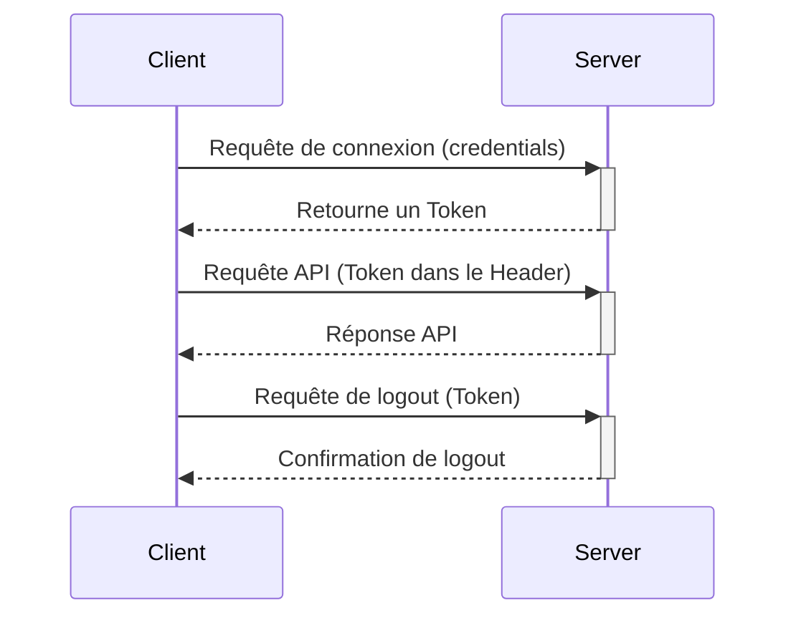

# Fonctionnement et maintenance

## Résumé rapide

L'application est divisée en deux parties :

- Une partie serveur (back-end), codée en PHP et optimisée via Symfony

- Une partie client (front-end) codée en React

Ces deux partis communiquent via des APIs : La partie client va demander à la partie serveur.

Nous stockons toutes les données dans une base de données MySQL.

L'application est basée sur une architecture par token pour échanger les données entre la partie front-end et la partie back-end, c'est à dire que chaque appel d'API nécessitant une authentification passera via un token

Voici un schéma résumant l'interaction par Token entre le client et le serveur



## Partie Back-end (PHP et Symfony)

> Documentations utiles : [Symfony Documentation](https://symfony.com/doc/current/index.html) [PHP: Manuel PHP - Manual](https://www.php.net/manual/fr/) 

La partie back-end est la seule partie capable d'interagir avec la base de données.

Cette partie se trouve dans le répertoire `/symfony`

La partie est divisée en plusieurs éléments. Ici, tout le code se trouve dans `/symfony/src`

Le dossier `/symfony/defis_assets` va permettre le stockage des différents fichiers téléchargeable via le bakc-end (voir API Fichier)

Cette partie va pouvoir communiquer avec le client via des endpoints API (terminaisons API)

Les endpoints sont implémentés via des controllers Symfony ([Controller (Symfony Docs)](https://symfony.com/doc/current/controller.html)).

Touts les endpoints vont être sous la route /api/ Cette approche nous permet de pouvoir avoir une distinction claire des parties back-end et front-end.

> Note pour ajouter un nouvel endpoint
> 
> Si vous ajoutez un nouvel endpoint, définissez la route comme /api/votre_endpoint

Nous utilisons OpenAPI, une norme de notation des endpoints qui permettent de pouvoir faciliter la vie des développeurs front-end, ainsi que des développeurs externes, en leur spécifiant les requêtes à réaliser ainsi que les arguments pour interagir avec notre back-end

> Pensez à ajouter la documentation OpenAPI si vous ajoutez un nouvel enpoint
> 
> Vous pouvez en savoir plus via :  [NelmioApiDocBundle Documentation](https://symfony.com/bundles/NelmioApiDocBundle/current/index.html) 


Pour interagir avec la base de données, nous utilisons des entitées (via la partie Doctrine ORM de Symfony) ([Databases and the Doctrine ORM (Symfony Docs)](https://symfony.com/doc/current/doctrine.html))

Pour chaque table stockant nos objets dans la base de données, nous avons une entités, avec des getters et des setters.

> N'utilisez pas de commandes SQL, cela pourait mener à une potentielle faille de sécurité. Utilisez uniquement les entités.


Pour ajouter des fonctionnalités à nos entités (par exemple : de pouvoir rechercher un utilisateur selon son adresse mail), nous utilisons les Repositories ([Databases and the Doctrine ORM (Symfony Docs)](https://symfony.com/doc/current/doctrine.html#querying-for-objects-the-repository))

Nous utilisons `createQueryBuilder`, qui nous permet de composer des requêtes avancées

Par exemple :

```php
public function findOneByMail($value): ?User
{
    return $this->createQueryBuilder('u')
        ->andWhere('u.mail = :val')
        ->setParameter('val', $value)
        ->getQuery()
        ->getOneOrNullResult()
    ;
}
```


